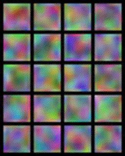

# 🙎‍♂️ gander
_Let's play with GANs - a WGAN-gp with a focus on simplicity_

This package contains a toy implementation of WGAN-gp applied to the CelebA dataset using pytorch-lightning.
We also implement the resolution doubling algorithm proposed by Karras et al. in their _Progressive Growing of Gans_ paper.



_Above: a gif showing the output of the network at as training progresses_

## Install the package

Using Python 3.8.1 or later (and a recent pip), you can install this package and all of its requirements directly from Github.
```
pip install git+https://github.com/rosshemsley/gander
```

## 🎓  Training the net

From within a virtualenv (this is strongly recommended).
```
$ train --root-dir /path/to/dir/containing/celba/dataset
```

This is just a shortcut for `python -m gander.cli.train`.

## 🙎‍♂️  Generate an image using the model

A small CLI to print an image to the terminal is provided (works with terminals
that support the imgcat protocol). 

From within a virtualenv with gander installed
```
$ generate --model-checkpoint /path/to/model/checkpoint
```
Prints an image directly to terminal.


## 🌄  Generate a gif from training

The demo gif included in this readme was generated using a bundled CLI tool as follows

From within a virtualenv with gander installed, run
```
$ gengif /path/to/tensorflow/eventlog/events.out.tfevents.xxxxx
```
